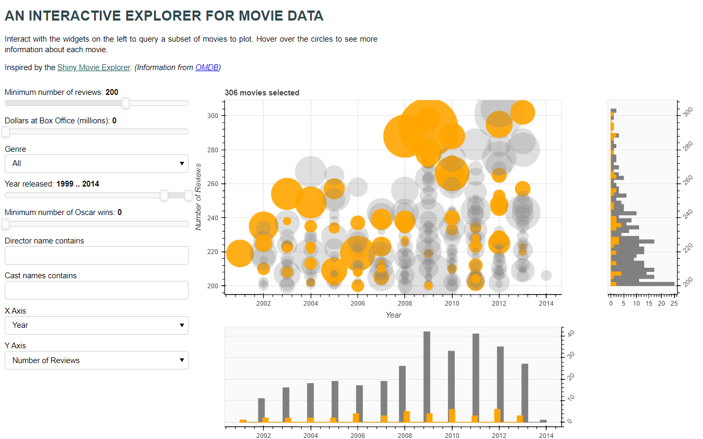

# Data Visualization
The intention of this repo is to provide some useful tools regarding
 data visualization and exploratory analysis
 
 The main topics here are:
 - pandas
 - bokeh
 - sql
 - Data visualization
 
 To run this app do the following
 1. Go to root folder
 2. Open terminal
 3. Create conda environment from _requirements.txt_
 4. Activate your new environment
 5. Download bokeh datasample
     ````commandline
    bokeh sampledata
    ````
 6. Run bokeh app
    ````commandline
    bokeh serve app --show
    ````
    
Note: if you have issues recreating your environment, follow this guide [conda envs](https://conda.io/projects/conda/en/latest/user-guide/tasks/manage-environments.html)
 or look this other [repo](https://github.com/AnomanderRK/time_tracker) with more detailed explanation
 
 # Preview
 This is how the tool looks like:
 